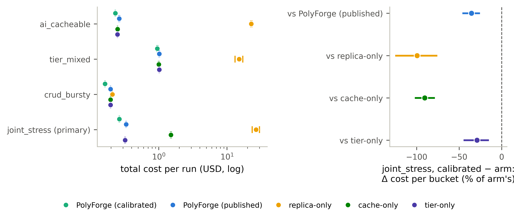

# fig20 — the B1′ live plane (figure sheet)

Generated by `fig_wave4_calibrated.py` from the same inputs and functions as `RESULTS_WAVE4_CALIBRATED.md` (`analysis_wave4_calibrated.py`); this sheet is the figure's caption and the numbers it plots, so the figure can be checked without rendering it. Not a record: it adds no reading.

**Caption.** B1′ on one L40S host, five arms × four cells × two reps. Left: total cost per run at iso-fairness (every arm's Jain index is within 0.01 of the calibrated arm's in every cell shown; the record lists the exceptions). Dots are the mean of two reps, ticks the reps. Right: the pre-registered primary reading — in joint_stress the calibrated joint controller's cost per 10-s bucket minus each arm's, paired by position within the load window, as a percentage of that arm's mean bucket cost, with the 95% paired-bootstrap CI (10,000 resamples, seed 20260915); a CI entirely left of zero is a win. Won against PolyForge (published), replica-only, cache-only, tier-only.

## Panel A — total cost per run (USD)

`window $` is the sum of the run's window buckets (what the pairing compares); `total` is the registered run-level metric, which also carries the WL-H2 preflight's own spend and any traffic outside the window.

| cell | arm | mean total | reps total | reps window $ |
|---|---|---|---|---|
| ai_cacheable | jcac-calibrated | 0.2314 | 0.2307, 0.2322 | 0.0806, 0.0948 |
| ai_cacheable | jcac | 0.2644 | 0.2684, 0.2604 | 0.1372, 0.1189 |
| ai_cacheable | replica-only | 22.7142 | 23.1945, 22.2339 | 23.0195, 22.0528 |
| ai_cacheable | cache-only | 0.2494 | 0.2493, 0.2496 | 0.1170, 0.1074 |
| ai_cacheable | tier-only | 0.2491 | 0.2489, 0.2494 | 0.1162, 0.1107 |
| tier_mixed | jcac-calibrated | 0.9545 | 0.9717, 0.9373 | 0.8309, 0.8066 |
| tier_mixed | jcac | 1.0189 | 1.0115, 1.0262 | 0.8785, 0.8914 |
| tier_mixed | replica-only | 15.0976 | 13.1513, 17.0438 | 12.6575, 16.8609 |
| tier_mixed | cache-only | 1.0053 | 1.0178, 0.9929 | 0.8841, 0.8605 |
| tier_mixed | tier-only | 1.0183 | 1.0144, 1.0223 | 0.8833, 0.8904 |
| crud_bursty | jcac-calibrated | 0.1636 | 0.1636, 0.1636 | 0.0352, 0.0331 |
| crud_bursty | jcac | 0.1967 | 0.1967, 0.1967 | 0.0640, 0.0661 |
| crud_bursty | replica-only | 0.2096 | 0.2096 | 0.0811 |
| crud_bursty | cache-only | 0.1967 | 0.1967, 0.1967 | 0.0661, 0.0640 |
| crud_bursty | tier-only | 0.1967 | 0.1967, 0.1967 | 0.0597, 0.0661 |
| joint_stress | jcac-calibrated | 0.2650 | 0.2660, 0.2639 | 0.1322, 0.1279 |
| joint_stress | jcac | 0.3332 | 0.3353, 0.3311 | 0.2069, 0.1973 |
| joint_stress | replica-only | 26.7047 | 29.9765, 23.4328 | 28.9175, 21.7975 |
| joint_stress | cache-only | 1.5120 | 1.4921, 1.5319 | 1.3438, 1.3900 |
| joint_stress | tier-only | 0.3220 | 0.3197, 0.3244 | 0.1870, 0.1795 |

## Panel B — joint_stress, calibrated − arm per window bucket

| vs arm | Δ % of arm's mean bucket cost | 95% CI | pairs | beats |
|---|---|---|---|---|
| jcac | -35.43% | [-46.21%, -25.54%] | 62 | yes |
| replica-only | -99.50% | [-125.42%, -75.70%] | 59 | yes |
| cache-only | -90.49% | [-102.32%, -78.69%] | 62 | yes |
| tier-only | -29.03% | [-44.88%, -15.06%] | 62 | yes |

