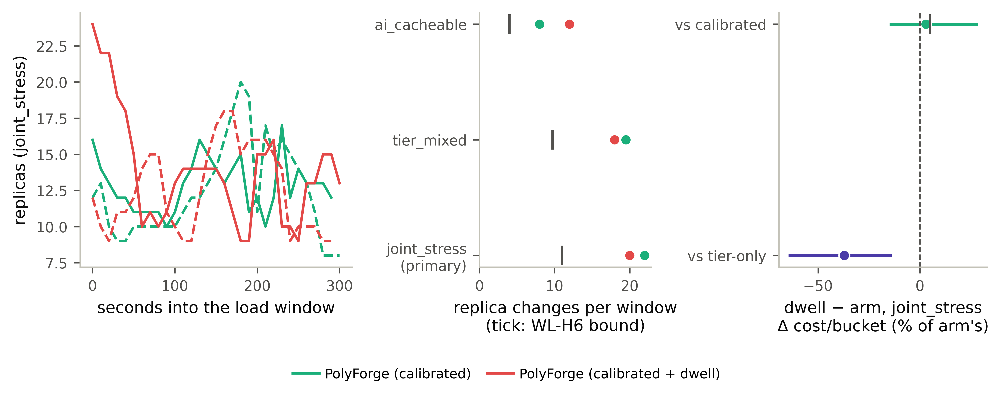

# fig21 — the B1″ damped controller (figure sheet)

Generated by `fig_wave4_dwell.py` from the same inputs and functions as `RESULTS_WAVE4_DWELL.md` (`analysis_wave4_dwell.py`); this sheet is the figure's caption and the numbers it plots, so the figure can be checked without rendering it. Not a record: it adds no reading.

**Caption.** B1″ on one L40S host, three arms × four cells × two reps, scored from the load window only. Left: the replica count every 10 s through the joint_stress window for the dwell-damped controller and the calibrated controller it damps (solid rep 0, dashed rep 1) — the oscillation is a slow swing, which a dwell on reversals cannot remove. Middle: WL-H6 — replica-count changes per window in the three AI cells, both controllers; the tick is the pre-registered bound, half the calibrated arm's changes, and the dwell arm must sit left of it: FAIL. Right: WL-H7 — the dwell arm's cost per 10-s bucket minus each arm's, paired by position within the window, as a percentage of that arm's mean bucket cost, with the 95% paired-bootstrap CI (10,000 resamples, seed 20260915); the tick on the calibrated row is the +5% non-inferiority bound. Non-inferior to the calibrated arm: NOT shown; beats tier-only: yes.

## Panel A — replica trajectories (every cell, both controllers)

Replica count per 10-s sample inside the load window, recovered from `cost_infra_usd` exactly as the record's churn is; only the primary cell is drawn, every cell is listed.

| cell | arm | rep | samples | min | max | changes | largest | trajectory |
|---|---|---|---|---|---|---|---|---|
| ai_cacheable | jcac-calibrated-dwell | 0 | 32 | 10 | 22 | 11 | 4 | 16 14 10 10 12 12 12 12 12 12 12 12 12 12 12 12 12 14 14 14 14 14 15 16 17 18 18 18 19 21 21 22 |
| ai_cacheable | jcac-calibrated-dwell | 1 | 31 | 9 | 20 | 13 | 4 | 16 12 10 10 10 10 10 10 9 9 9 9 9 9 9 9 11 11 12 12 12 13 14 15 15 16 17 18 18 19 20 |
| ai_cacheable | jcac-calibrated | 0 | 31 | 10 | 15 | 7 | 1 | 12 12 12 12 11 11 11 11 11 10 10 10 10 10 10 11 11 11 11 11 12 12 12 12 13 13 14 15 15 15 15 |
| ai_cacheable | jcac-calibrated | 1 | 31 | 8 | 16 | 9 | 6 | 16 10 11 11 10 9 8 8 8 8 8 8 8 8 8 8 8 8 8 8 8 8 8 9 9 10 11 12 12 12 12 |
| tier_mixed | jcac-calibrated-dwell | 0 | 31 | 8 | 24 | 18 | 4 | 16 15 18 22 24 24 23 23 19 17 17 15 16 13 11 10 9 8 8 8 8 9 9 9 8 8 8 8 8 10 12 |
| tier_mixed | jcac-calibrated-dwell | 1 | 31 | 8 | 22 | 18 | 3 | 15 17 20 22 22 22 22 20 17 15 15 14 13 12 9 9 8 8 9 9 10 9 10 9 9 8 8 8 10 10 10 |
| tier_mixed | jcac-calibrated | 0 | 31 | 8 | 23 | 20 | 6 | 15 21 23 22 22 21 20 19 17 13 15 12 12 12 14 10 9 9 13 8 9 8 8 8 8 8 9 8 8 8 9 |
| tier_mixed | jcac-calibrated | 1 | 31 | 8 | 23 | 19 | 6 | 15 17 23 21 21 21 20 18 14 16 13 11 13 13 11 12 10 9 9 8 9 9 9 8 8 9 8 8 8 8 8 |
| crud_bursty | jcac-calibrated-dwell | 0 | 31 | 8 | 16 | 1 | 8 | 16 8 8 8 8 8 8 8 8 8 8 8 8 8 8 8 8 8 8 8 8 8 8 8 8 8 8 8 8 8 8 |
| crud_bursty | jcac-calibrated-dwell | 1 | 31 | 8 | 8 | 0 | 0 | 8 8 8 8 8 8 8 8 8 8 8 8 8 8 8 8 8 8 8 8 8 8 8 8 8 8 8 8 8 8 8 |
| crud_bursty | jcac-calibrated | 0 | 31 | 8 | 8 | 0 | 0 | 8 8 8 8 8 8 8 8 8 8 8 8 8 8 8 8 8 8 8 8 8 8 8 8 8 8 8 8 8 8 8 |
| crud_bursty | jcac-calibrated | 1 | 32 | 8 | 16 | 1 | 8 | 16 8 8 8 8 8 8 8 8 8 8 8 8 8 8 8 8 8 8 8 8 8 8 8 8 8 8 8 8 8 8 8 |
| joint_stress | jcac-calibrated-dwell | 0 | 31 | 9 | 24 | 20 | 6 | 24 22 22 19 18 15 10 11 10 11 13 14 14 14 14 14 13 11 9 9 15 15 16 10 10 9 13 13 15 15 13 |
| joint_stress | jcac-calibrated-dwell | 1 | 30 | 9 | 18 | 20 | 5 | 12 10 9 11 11 12 14 15 15 11 10 9 9 12 15 17 18 18 15 16 16 16 15 14 9 10 10 10 9 9 |
| joint_stress | jcac-calibrated | 0 | 30 | 10 | 17 | 23 | 5 | 16 14 13 12 12 11 11 11 11 10 11 13 14 16 15 14 13 14 15 11 12 10 12 17 12 14 13 13 13 12 |
| joint_stress | jcac-calibrated | 1 | 31 | 8 | 20 | 21 | 8 | 12 13 10 9 9 10 10 10 10 10 10 11 12 12 13 14 16 18 20 19 11 17 15 16 15 14 13 11 8 8 8 |

## Panel B — WL-H6 replica churn (AI cells)

| cell | dwell changes | dwell largest | calibrated changes | calibrated largest | bound (½ calibrated) | pass |
|---|---|---|---|---|---|---|
| ai_cacheable | 12.0 | 4 | 8.0 | 6 | 4.0 | no |
| tier_mixed | 18.0 | 4 | 19.5 | 6 | 9.8 | no |
| joint_stress | 20.0 | 6 | 22.0 | 8 | 11.0 | no |

## Panel C — joint_stress, dwell − arm per window bucket

| vs arm | Δ % of arm's mean bucket cost | 95% CI | pairs | bound |
|---|---|---|---|---|
| jcac-calibrated | +3.02% | [-14.82%, +28.49%] | 60 | +5% |
| tier-only | -37.18% | [-64.60%, -13.77%] | 61 | n/a |

