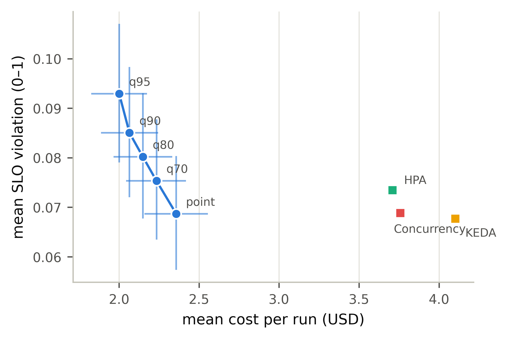

# Risk-aware (quantile) MPC — results (pre-registered)

Protocol frozen in `PREREG_RISK_MPC.md`, pushed before any run. The published controller plans at the *expected* demand, so realized demand lands above plan roughly half the time — the mechanism behind the disclosed attainment-for-spend trade. Here each candidate is scored against a **quantile of the controller's own forecast errors** (distribution-free, floored at zero). `risk_quantile=None` remains the published path and was verified bit-identical (max drift 0.00e+00) before the anchor push. This revises no closed campaign: v2 H1 and v3 H1′ stand as measured for the base controller. Rerun: `python analysis_risk.py`.

Valid runs: 2400 over 8 systems (300 matched cells per arm)

## The frontier (mean over matched cells, 95% bootstrap CI)

| system | total_cost_usd | cost_lo | cost_hi | mean_violation | viol_lo | viol_hi | J |
|---|---|---|---|---|---|---|---|
| PolyForge (point forecast) | 2.357 | 2.16 | 2.556 | 0.06869 | 0.05734 | 0.08035 | 0.4005 |
| PolyForge q=0.70 | 2.235 | 2.045 | 2.419 | 0.07532 | 0.06346 | 0.08777 | 0.402 |
| PolyForge q=0.80 | 2.149 | 1.966 | 2.332 | 0.08018 | 0.06771 | 0.09305 | 0.4034 |
| PolyForge q=0.90 | 2.065 | 1.888 | 2.244 | 0.08504 | 0.07202 | 0.09831 | 0.4048 |
| PolyForge q=0.95 | 2.001 | 1.827 | 2.176 | 0.09292 | 0.07906 | 0.107 | 0.4152 |
| HPA (tuned) | 3.71 | 3.338 | 4.083 | 0.07343 | 0.06089 | 0.08669 | 0.5552 |
| KEDA (tuned) | 4.102 | 3.754 | 4.455 | 0.06768 | 0.05425 | 0.08184 | 0.5817 |
| Concurrency (tuned) | 3.758 | 3.389 | 4.129 | 0.06882 | 0.0569 | 0.08123 | 0.5501 |

## RQ-H1 (confirmatory) — is the risk knob a real control?

| reading | spearman_rho | verdict |
|---|---|---|
| violation vs quantile rank (want ρ ≤ −0.9) | 1 | FAIL |
| cost vs quantile rank (want ρ ≥ +0.9) | -1 | FAIL |

**RQ-H1: FAIL** — the residual-quantile knob does not move the system monotonically along the cost/violation trade. Per §3 the mechanism is published as a **null**, in the same tradition as the γ-term: the idea is sound in principle but does not steer this system, and no frontier claim follows.

## RQ-H2 (confirmatory) — dominance at the pre-declared q = 0.90

| reading | n | jcac_q90 mean | other mean | diff | p | d_z | verdict |
|---|---|---|---|---|---|---|---|
| violation vs point-forecast MPC (want < 0) | 300 | 0.08504 | 0.06869 | 0.01635 | 3.698e-24 | 0.6401 | FAIL |
| cost vs tuned hpa (want < 0) | 300 | 2.065 | 3.71 | -1.644 | 3.471e-34 | -0.8019 | PASS |
| cost vs tuned keda (want < 0) | 300 | 2.065 | 4.102 | -2.037 | 6.518e-51 | -1.06 | PASS |
| cost vs tuned concurrency (want < 0) | 300 | 2.065 | 3.758 | -1.693 | 7.305e-36 | -0.8281 | PASS |

**RQ-H2: FAIL** — per the pre-committed falsifier, attainment cannot be bought cheaply even with an explicit risk knob at the declared operating point. The project's standing honest boundary — *attainment costs money* — is confirmed for our own controller and published as such. The frontier table above still shows what the knob does buy, and at what price.

## RQ-D1 (descriptive, no gate) — what each step of the knob buys

| arm | Δviolation | p(viol) | Δcost USD | p(cost) | ΔJ | p(J) |
|---|---|---|---|---|---|---|
| PolyForge q=0.70 | 0.006633 | 1.129e-17 | -0.123 | 5.537e-26 | 0.001534 | 0.2284 |
| PolyForge q=0.80 | 0.01149 | 2.587e-22 | -0.2081 | 5.855e-24 | 0.002894 | 0.04051 |
| PolyForge q=0.90 | 0.01635 | 3.698e-24 | -0.292 | 5.912e-25 | 0.004334 | 0.02201 |
| PolyForge q=0.95 | 0.02423 | 1.186e-31 | -0.3562 | 2.938e-27 | 0.01474 | 1.138e-14 |

Baseline operating points Pareto-dominated by at least one frontier arm (strictly cheaper *and* strictly lower violation): **HPA (tuned), Concurrency (tuned)**.

Per workload class (Δviolation at q=0.90 vs the point-forecast MPC):

| class | Δviolation | p | Δcost USD | n |
|---|---|---|---|---|
| agentic | 0.02836 | 7.864e-09 | -0.7846 | 60 |
| ai_cacheable | 0.03136 | 1.257e-11 | -0.4464 | 60 |
| ai_uncacheable | 0.02247 | 6.279e-12 | -0.2428 | 60 |
| crud_bursty | -0.0004612 | 0.274 | 0.01182 | 60 |
| crud_steady | 3.578e-07 | 0.9245 | 0.001956 | 60 |

## POST-RUN DIAGNOSIS (added after the frozen readings were scored)

Prose only — no datum above is changed, and the FAIL verdicts stand as the campaign's result. This section exists because the failure is *perfectly monotone in the reverse direction* (ρ = +1 / −1), which is a systematic effect, not noise, and the project's practice is to publish the diagnosis with the null (the `PLANNER_CELLS` aliasing precedent).

**What happened.** The knob was applied to the whole projection — both the SLO/capacity term *and* the cost term. Inflating demand also inflates *projected spend*, because tier (inference) cost is `miss_rps × interval × price` and scales with demand. That pushes candidates past the per-tenant budget filter (`_best_for_tenant`: `if cost > budget_per_step: continue`), and when the lattice empties the controller takes its designed fallback: shed to `replicas=min, cache=0, tier="none"` — an AI outage. Shedding is cheap, so **cost falls**; the outage is a total SLO miss, so **violation rises**. The knob was fighting the Budget CRD, not the demand.

**Evidence.** (a) The class breakdown above: `crud_bursty` and `crud_steady` show *no* effect (p = 0.27, 0.92) — CRUD carries no tier spend, so its budget headroom is untouched — while all three AI classes move sharply. (b) A targeted probe (`ai_cacheable/uniform/medium`, seed 4242) counts the shed state directly: `tier="none"` occurs **0** times at the point forecast, **2** at q=0.90 and **4** at q=0.95, while mean replicas *rise* 2.64 → 2.93 — the capacity half of the mechanism worked exactly as designed; the budget interaction defeated it.

**What this does and does not license.** It does *not* rescue the hypotheses: as specified and pre-registered, the mechanism failed, and that is the published result. It does identify one changed factor for a disciplined follow-up: **size capacity against the risk-inflated demand but project cost and check the budget against the point forecast** — you are billed for the demand that *arrives*, not the demand you provisioned against. That follow-up requires its own pre-registration (the `PREREG_PLANNER_CELLS_DEALIAS` precedent: a new prereg with one changed factor, never a silent re-run), and this campaign's stopping rule forbids re-running it here.

## Notes

- The knob is **distribution-free**: the empirical quantile of the controller's own realized one-step forecast errors, floored at zero so it may only add headroom. No normality assumption, no oracle.
- Orthogonal to `adaptive_capacity` (which corrects model optimism); this corrects demand variance. Neither substitutes for the other.
- Substrate rules unchanged: sim-backend decision quality, blocked-factorial matched cells, never mixed with replay tables.
- The **overload (v3) regime**, where the attainment trade binds hardest, was pre-declared as the follow-up and is deliberately not run here; no overload claim may be read from these cells.
- Stopping rule §4 honored: one matrix execution, one analysis pass, frozen quantile grid, operating point declared before the data existed.
