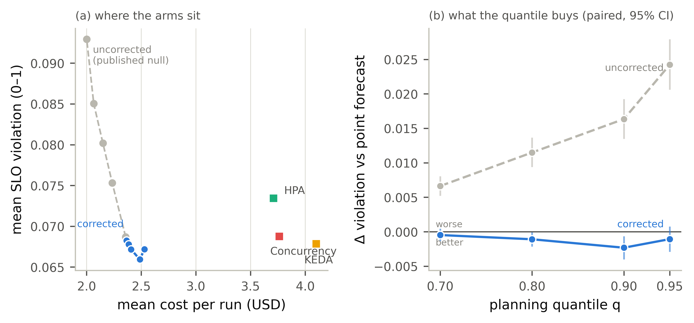

# Budget-corrected risk MPC — results (pre-registered)

Protocol frozen in `PREREG_RISK_BUDGET.md`, pushed before any run — the disciplined one-changed-factor follow-up to the published `RESULTS_RISK.md` null (capacity sized at the risk quantile; cost projected and budget checked at the point forecast, because a tenant is billed for the demand that arrives, not the demand it was provisioned against). The null stands as measured and was never re-run; `risk_cost_at_point` defaults off and both prior campaigns replay at drift 0.00e+00. Rerun: `python analysis_risk_budget.py`.

Valid runs: 2400 over 8 systems (300 matched cells per arm)

## The corrected frontier (mean over matched cells, 95% bootstrap CI)

| system | total_cost_usd | cost_lo | cost_hi | mean_violation | viol_lo | viol_hi | J |
|---|---|---|---|---|---|---|---|
| PolyForge (point forecast) | 2.366 | 2.163 | 2.563 | 0.06825 | 0.05683 | 0.08008 | 0.4004 |
| PolyForge q=0.70 (corrected) | 2.386 | 2.178 | 2.587 | 0.06777 | 0.05665 | 0.07946 | 0.4015 |
| PolyForge q=0.80 (corrected) | 2.407 | 2.2 | 2.606 | 0.06716 | 0.05605 | 0.07862 | 0.4022 |
| PolyForge q=0.90 (corrected) | 2.487 | 2.273 | 2.695 | 0.06593 | 0.05545 | 0.07684 | 0.4082 |
| PolyForge q=0.95 (corrected) | 2.528 | 2.314 | 2.737 | 0.06718 | 0.05635 | 0.07839 | 0.4154 |
| HPA (tuned) | 3.71 | 3.334 | 4.085 | 0.07342 | 0.0604 | 0.08645 | 0.5553 |
| KEDA (tuned) | 4.101 | 3.749 | 4.457 | 0.06786 | 0.05419 | 0.08185 | 0.582 |
| Concurrency (tuned) | 3.763 | 3.386 | 4.137 | 0.06874 | 0.05663 | 0.08095 | 0.5504 |

## RB-H1 (confirmatory) — does the corrected knob buy attainment?

| reading | n | q90c mean | point mean | diff | 95% CI | p | d_z | verdict |
|---|---|---|---|---|---|---|---|---|
| violation, q90c − point (want < 0) | 300 | 0.06593 | 0.06825 | -0.002317 | [-0.00402, -0.0006431] | 0.007327 | -0.1559 | PASS |
| cost, q90c − point (context, no gate) | 300 | 2.487 | 2.366 | 0.1212 | [0.09165, 0.1534] | 7.459e-13 | 0.4328 | — |

**RB-H1: PASS** — the exact reading the uncorrected mechanism failed with the sign reversed now lands as designed: at q=0.90 the controller violates significantly less than its own point-forecast configuration. The one changed factor was the defect.

## RB-H2 (confirmatory) — is the corrected frontier monotone?

| reading | spearman_rho | verdict |
|---|---|---|
| violation vs quantile rank (want ρ ≤ −0.9) | -0.7 | FAIL |
| cost vs quantile rank (want ρ ≥ +0.9) | 1 | PASS |

**RB-H2: FAIL** — cost moves as designed (ρ = +1), but violation does not clear the bar (ρ = -0.7, required ≤ −0.9). Violation falls monotonically through `jcac_q90c` (0.06593) and then turns back up at `jcac_q95c` (0.06718): the corrected knob has an **interior optimum**, not a monotone frontier — and it falls on the operating point declared before the data existed. Per the pre-committed falsifier, no frontier claim is made; what the knob buys is reported at the declared operating point only.

## RB-H3 (confirmatory) — strict Pareto domination of the tuned reactive stack

| conjunct | n | q90c mean | baseline mean | diff | 95% CI | p | d_z | verdict |
|---|---|---|---|---|---|---|---|---|
| violation, q90c − hpa (want < 0) | 300 | 0.06593 | 0.07342 | -0.007495 | [-0.01394, -0.0009882] | 0.02557 | -0.1296 | FAIL |
| cost, q90c − hpa (want < 0) | 300 | 2.487 | 3.71 | -1.223 | [-1.441, -1.013] | 1.767e-24 | -0.6455 | PASS |
| violation, q90c − keda (want < 0) | 300 | 0.06593 | 0.06786 | -0.001926 | [-0.008835, 0.004859] | 0.585 | -0.03156 | FAIL |
| cost, q90c − keda (want < 0) | 300 | 2.487 | 4.101 | -1.613 | [-1.825, -1.41] | 3.414e-39 | -0.8797 | PASS |
| violation, q90c − concurrency (want < 0) | 300 | 0.06593 | 0.06874 | -0.002814 | [-0.008871, 0.003395] | 0.376 | -0.05119 | FAIL |
| cost, q90c − concurrency (want < 0) | 300 | 2.487 | 3.763 | -1.275 | [-1.491, -1.065] | 2.141e-26 | -0.6773 | PASS |

**RB-H3: FAIL** — strict domination was not established; the failed conjunct(s) are marked above and the claim is reported as partial dominance only, exactly as pre-committed. No rounding up.

## RB-D1 (descriptive, no gate)

What each step of the corrected knob buys (vs the point-forecast MPC):

| arm | Δviolation | p(viol) | Δcost USD | p(cost) | ΔJ | p(J) |
|---|---|---|---|---|---|---|
| PolyForge q=0.70 (corrected) | -0.0004783 | 0.2847 | 0.01976 | 0.0009237 | 0.001177 | 0.2191 |
| PolyForge q=0.80 (corrected) | -0.001092 | 0.03962 | 0.04119 | 1.12e-07 | 0.00187 | 0.0926 |
| PolyForge q=0.90 (corrected) | -0.002317 | 0.007327 | 0.1212 | 7.459e-13 | 0.007887 | 1.862e-07 |
| PolyForge q=0.95 (corrected) | -0.001068 | 0.251 | 0.1625 | 3.585e-13 | 0.01506 | 3.714e-12 |

Baseline operating points that plot up-and-right of at least one frontier arm **on means** — descriptive only, and deliberately *not* the same statement as RB-H3, whose paired violation conjuncts did not clear the bar: **HPA (tuned) (by anchored, q70c, q80c, q90c, q95c); KEDA (tuned) (by q70c, q80c, q90c, q95c); Concurrency (tuned) (by anchored, q70c, q80c, q90c, q95c)**.

Per workload class (Δviolation and Δcost, q90c vs point-forecast MPC):

| class | Δviolation | p | Δcost USD | n |
|---|---|---|---|---|
| agentic | -0.01859 | 1.375e-09 | 0.5063 | 60 |
| ai_cacheable | -0.002244 | 0.0054 | 0.05661 | 60 |
| ai_uncacheable | 0.009341 | 2.588e-05 | 0.02511 | 60 |
| crud_bursty | -0.0001017 | 0.8127 | 0.01621 | 60 |
| crud_steady | 8.571e-06 | 0.1852 | 0.001942 | 60 |

**Figure 19.** One changed factor reverses the mechanism. **(a)** The landscape: every PolyForge arm (blue) sits far left of the tuned reactive stack (squares) — the separation that survives pairing is cost, 33–39% less spend at the declared operating point — while the corrected frontier now runs downward where the uncorrected null (grey dashes) ran up and to the left. Down-and-left is better. **(b)** What the quantile buys, as the gates measure it: violation paired against each campaign's own point-forecast arm, 95% bootstrap CI. The correction flips the sign of the mechanism (blue below zero, grey above), and RB-H1 passes at the pre-declared q=0.90 — but the curve turns back up at q=0.95, an interior optimum rather than the monotone frontier RB-H2 required, so no frontier claim is made. Against the reactive arms the violation differences do not separate, so RB-H3's strict domination is not claimed either.

## POST-RUN DIAGNOSIS (added after the frozen readings were scored)

Prose only — no datum above is changed and every verdict stands as scored. Two readings need a mechanism: RB-H2 failed because violation falls through q=0.90 and then turns **back up** at q=0.95 (an interior optimum, not noise), and `ai_uncacheable` is the one class that gets *worse* at the operating point while every other AI class improves. The project's practice is to publish the diagnosis with the result (the `PLANNER_CELLS` aliasing precedent).

**Method.** An exploratory probe (fixes no number, outside the frozen protocol) replays 24 cells — {point, q90c, q95c} × {ai_uncacheable, ai_cacheable, agentic, crud_bursty} × {uniform, premium_heavy} at `medium`, rep 0 — with timeseries on, and counts the controller's internal state directly: shed events (`tier="none"`), the tier mix, mean replicas against the cluster ceiling, and mean cache.

**Finding 1 — the correction works, but does not abolish the budget interaction.** On `ai_uncacheable` the shed rate *falls* from 0.89% at the point forecast to **0.31%** at q90c — the correction doing exactly what it was designed to do — and then rises to **2.08%** at q95c, above even the uncorrected starting point. Capacity still costs money at *any* forecast, so at an extreme quantile the per-tenant budget filter binds again and the designed shed fallback returns. The `crud_bursty` control shows **0.00% shed at every arm**, confirming the channel is tier spend — the same signature the null's diagnosis identified.

**Finding 2 — the knob buys attainment only where a capacity lever still has headroom.** The `medium` cluster caps replicas at 48 across 8 tenants, i.e. a mean of 6.00 per tenant when saturated:

| class | mean replicas (point→q90c→q95c) | % of cluster ceiling | what the knob buys |
|---|---|---|---|
| ai_cacheable | 3.04 → 3.28 → 3.53 | 51–59% (headroom) | real replicas; violation falls |
| agentic | 5.95 → 5.94 → 5.95 | 99% (saturated) | tier upgrades (small 76%→56%, mid 12%→28%); violation falls, cost rises sharply |
| ai_uncacheable | 5.91 → 5.94 → 5.93 | 99% (saturated) | cache (377→481 MB) on a class only ~29% cacheable and past half-saturation; spend, not service |
| crud_bursty | 5.65 → 5.63 → 5.62 | 94% | nothing — no tier spend, violation already ~0 |

This is one mechanism for both anomalies. Where the replica budget has headroom (`ai_cacheable`), risk headroom converts into capacity and attainment improves cheaply. Where replicas are pinned at the cluster ceiling, the controller can only chase the inflated target through the levers that remain: tier upgrades, which work but cost real money and eventually re-trip the budget filter (`agentic`), or cache, which on a low-cacheable class past its half-saturation point returns almost nothing (`ai_uncacheable`). **The risk knob converts forecast headroom into attainment only insofar as some capacity lever still has headroom with a real return; where the levers are saturated or low-return, the inflated target is converted into spend instead of service.** That is why the aggregate frontier has an interior optimum rather than a monotone one.

**Scope.** The probe is 24 cells at one cluster size; the campaign's gates are scored over 300 matched cells per arm across three sizes. It reproduces the sign of every per-class effect in the RB-D1 table (`agentic` and `ai_cacheable` improve, `ai_uncacheable` regresses, CRUD inert) but it is an illustration of the mechanism, not a second measurement of the effect, and no number here revises anything above.

## Notes

- One changed factor from the published null, nothing else: same grid, same operating point, same baselines, same matrix shape. The null was never re-run and `risk_cost_at_point=False` keeps it bit-reproducible.
- The corrected knob's cost is real and reported: buying attainment raises spend along the frontier. The claim is *where the frontier sits* relative to the reactive stack, not that headroom is free.
- **The knob is not a new default, and is not claimed as one.** Under the published objective weights the corrected arm is net *worse* on composite J than the point forecast (ΔJ = +0.007887, p = 1.86e-07): the attainment it buys costs more than the weights say attainment is worth. The point-forecast controller stays the quotable configuration, and this campaign is evidence *for* that default, not against it.
- What the campaign does contribute is the conversion of a named limitation into a measured dial: the standing caveat that our win is "conditional on operator SLO-tolerance" is now an explicit knob with a price curve attached, so an operator whose weights differ from ours can read off what tightening attainment costs — and where (per the diagnosis) it stops being purchasable at all.
- Substrate rules unchanged: sim-backend decision quality, matched cells, never mixed with replay tables. Overload (v3) regime remains the declared follow-up; no overload claim from these cells.
- Stopping rule §4 honored: one matrix execution, one analysis pass; if RB-H1 had failed the risk line would have ended with two nulls.
